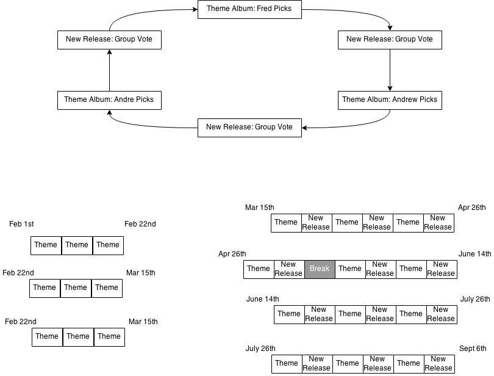

# Review Process

This document describes how we go about reviewing albums.

## Schedule

The Musical Review began 1st February 2015.

The schedule we ran by was originally a simple three week cycle, where each of us chose an album which related to a chosen theme. At the end of the three week cycle, a new theme would be chosen by majority vote.

Starting from 15th March 2015, we added in a fortnightly "New Release" week, where we chose a new release from the last month to review. This allowed us to break away from our theme, and keep the spread of albums we reviewed relatively wide.

The new six week cycle is as follows:
* Fred's theme choice
* Group voted "New Release" choice
* Andrew's theme choice
* Group voted "New Release" choice
* Andre's theme choice
* Group voted "New Release" choice

## Process

### Listening

We take a week to listen to the chosen album, each of us tries to listen to the album at least three times in order to get to know it well before discussing it.

At the end of the week, we discuss the album (currently via instant messenger), track by track. We will speak about both the technical and characteristic aspects of each track, as well as the meaning behind the track or the section of the album.

### Ratings

At the end of the discussion, which generally lasts around 1-2 hours, we will first each produce a conclusion, a score (currently out of 10) and a list of our three favourite tracks.

This is then condensed into an overall summary, an overall score (currently out of 30) and a list of our combined three favourite tracks.

#### Combined Track Selection

If there is a track that we've all picked, this is known as an **essential track** for that album. This is signalled by only one track appearing in the summary for that album. If more than one track is chosen by all of us. We will do a majority vote as to which one to choose as **essential**.

To choose the remaining tracks, where we haven't selected the same tracks, we will each pick the favourite of another reviewers favourite track list. Either this selection acts a majority vote (if two or more of us have picked the same track), or it provides us with a selection to vote on. This process continues until we have three favourite tracks.

If there is no **essential track**, all three of the combined favourite tracks will be displayed on the summary page of this review store.
